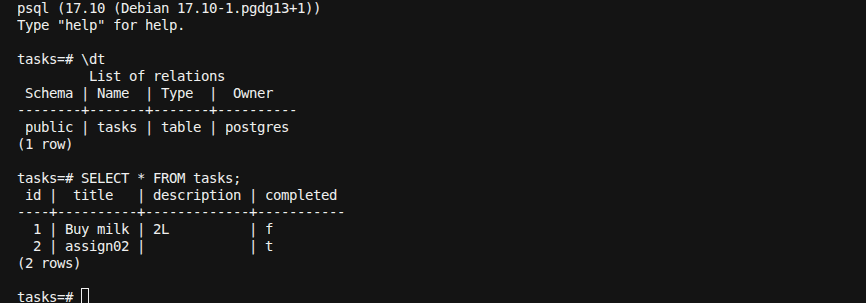

# Task API

FastAPI task service upgraded from a single-file prototype into a production-oriented codebase.

## CHECKPOINT — AI vs me

### Full prompt I used

```text
i want you to convert it in production grade
with error handler, api response handler, input validation, helmet, rate limit, etc
```

Follow-up prompts after the first pass:

```text
now compare previous and now generated code and write in readme file
```

```text
no i want to you to write down what kind of significant imporve occur from code.
```

```text
add a search api with pagination sperate one
```

### Concrete differences I found (AI output vs my original code)

1. **HTTP status codes vs fake errors**  
   My original code returned `"Task not found"` with status `200`. The AI version raises real exceptions and returns `404` / `422` / `429` / `500` through a shared error envelope. Clients can now trust status codes instead of parsing an `error` field on success responses.

2. **One file vs layered package**  
   I had everything in `main.py` (model + routes + global `tasks` list). The AI split this into routes, schemas, service, core handlers, and middleware. That is more code to read, but route handlers no longer mutate storage directly and validation lives in Pydantic schemas instead of being implicit.

3. **Filter bug vs correct search/list**  
   My `/task` filter used a global `filterTasks` list that was never cleared, so results duplicated across requests. The AI version filters with a fresh list per call, and later a separate `/tasks/search` API adds pagination (`page`, `page_size`, `total`, `total_pages`) which my original code did not have at all.

4. **Security middleware I did not write**  
   I only had bare FastAPI routes. The AI added Helmet-style security headers, SlowAPI rate limits, CORS, Trusted Host, request IDs, and `.env` settings. One concrete catch: the first CSP (`default-src 'none'`) broke `/docs` (empty Swagger page) until CSP was relaxed for docs routes — something I had to notice and fix after running the server.

5. **REST paths vs my verb URLs**  
   I used `/create`, `/update/{id}`, `/delete/{id}`. The AI changed them to `/tasks` REST paths and auto-generates IDs instead of trusting the client-supplied `id`. Behavior is the same for CRUD, but the public API surface is different from what I originally shipped.

---

## CHECKPOINT — AI vs me (database)

### Full prompt I used

```text
I have added database
Please check if anything is missing or need to improve
```

After the review, I approved the fix plan:

```text
Fix incomplete SQLite database integration
Implement the plan as specified...
```

### Concrete differences I found (my DB attempt vs AI fix)

1. **Half-migrated routes vs one storage path**  
   I added `app/Database/` helpers and started calling them from routes, but `TaskService` was still in-memory and some handlers still injected `service` unused. The AI routed everything through `TaskService` → `app/db` helpers so there is only one storage path, not two fighting each other.

2. **Bugs in my SQLite helpers that would crash at runtime**  
   My code used `dict(row)` without `row_factory = sqlite3.Row`, `get_task_by_id` referenced undefined `rows`, and create assumed `task.id` while `insert_task` returned only `lastrowid`. Search applied `LIKE` to the boolean `completed` column and ignored the `completed` filter. The AI fixed row mapping, returns full task rows after insert/update/delete, and merged search into one query with proper `WHERE` + pagination.

3. **Name shadowing in routes**  
   My `search_tasks` / `update_task` / `delete_task` route functions had the same names as the DB helpers, so they called themselves (or the wrong function) instead of the database. The AI restored thin route names that only call `service.*`.

4. **Broken connection dependency vs lifespan init**  
   I wrote a `create_connection` generator (missing `Request` import) and called it once at app startup with no request. It was never used as `Depends(...)`.    The AI deleted that unused dependency, opens connections inside helpers, creates the table on startup via FastAPI `lifespan`, and reads `DATABASE_URL` from settings / `.env`.

5. **Package / hygiene**  
   I used `app/Database` (capital D) with a local `task.db` that could be committed. The AI moved helpers to `app/db/`, added `*.db` to `.gitignore`, and documented SQLite persistence in the README.

---

## Significant code improvements

### 1. Architecture — from one file to layered modules

**Before:** Everything lived in `main.py` — models, routes, storage, and response formatting mixed together. Any change risked breaking unrelated logic.

**Now:** Responsibilities are split:

- **Routes** (`app/api/routes/`) — HTTP only: parse input, call service, return envelope
- **Schemas** (`app/schemas/`) — request/response contracts and validation rules
- **Service** (`app/services/`) — business rules over SQLite persistence
- **DB** (`app/db/`) — raw `sqlite3` helpers for the `tasks` table
- **Core** (`app/core/`) — shared errors, responses, security, rate limiting
- **Config** (`app/config.py`) — environment-driven settings (including `DATABASE_URL`)

This makes the API easier to test, extend, and reason about.

### 2. Correctness bugs fixed

**Filter endpoint bug:** A global `filterTasks` list was never cleared between requests, so results grew and duplicated over time.

**Now:** Each list/filter request builds a fresh result list inside the service. No shared mutable filter state.

**Error semantics bug:** Missing tasks returned HTTP `200` with `{ "error": "Task not found" }`, so clients could not rely on status codes.

**Now:** Missing resources raise `NotFoundError` and return HTTP `404` with a standard error body. Create returns `201`.

### 3. Consistent API contract

**Before:** Each route built its own dict (`name`, `version`, `endpoints`, `task` / `tasks` / `error`). Shapes differed and clients had to special-case errors.

**Now:** Every success and failure goes through shared helpers:

- Success: `{ success, message, data, meta }`
- Error: `{ success, message, errors, meta }`

`meta` always includes API version and `request_id` for tracing.

### 4. Centralized error handling

**Before:** No custom exception layer. Failures were either silent `200` errors or FastAPI’s default responses.

**Now:** Domain exceptions (`NotFoundError`, `ConflictError`, `AppException`) plus global handlers for:

- Validation errors → `422`
- App exceptions → matching status codes
- Rate limit exceeded → `429`
- Unexpected errors → `500` with a safe message (no stack traces leaked to clients)

### 5. Stronger input validation

**Before:** One `Task` model; client chose `id`; no length limits.

**Now:**

- `TaskCreate` / `TaskUpdate` / `TaskResponse` are separate models
- `title` and `description` have length constraints
- Task IDs are generated by the service (avoids collisions)
- Path IDs must be `> 0`

Invalid payloads fail fast with a structured validation error.

### 6. Production cross-cutting concerns added

These did not exist in the old code:

| Improvement | What it does in code |
|-------------|----------------------|
| Security headers | Middleware sets Helmet-like headers (CSP, frame deny, nosniff, etc.) |
| Rate limiting | SlowAPI limits abuse (`100/min` reads, `20/min` writes) |
| CORS / Trusted Host | Configurable allowed origins and hosts via settings |
| Request ID | Middleware assigns `X-Request-ID` and attaches it to responses |
| Settings / `.env` | No more hardcoded app name/version; env-driven config |
| Logging | App-level structured logs with configurable level |

### 7. PostgreSQL persistence

**Before:** Bare global `tasks = []` mutated directly in route handlers (lost on restart).

**Now:** Tasks are stored in PostgreSQL via `psycopg` (`DATABASE_URL`). `TaskService` calls `app/db` helpers; the table is created on app startup via lifespan. Run with Docker Compose (`db` + `api`) or a local Postgres instance.

Verify data inside the container:

```bash
docker exec -it taskdb psql -U postgres -d tasks
```



### 8. REST endpoint design

Verb-style paths (`/create`, `/update/{id}`, `/delete/{id}`, `/task`) were replaced with resource-oriented routes (`/tasks`, `/tasks/{id}`). Behavior is the same; the API surface is clearer and closer to common REST practice.

---

## Setup

```bash
python -m venv .venv
source .venv/bin/activate
pip install -r requirements.txt
cp .env.example .env
```

## Run

**Option A — Docker (API + PostgreSQL):**

```bash
docker compose up --build
```

- Docs: http://127.0.0.1:8000/docs

**Option B — Local uvicorn (Postgres via Compose on host port 5433):**

```bash
# start only the database
docker compose up db -d

uvicorn main:app --reload
```

- Docs: http://127.0.0.1:8000/docs
- Health: `GET /` or `GET /health`

## Endpoints

| Method | Path | Description |
|--------|------|-------------|
| GET | `/` or `/health` | Health check |
| POST | `/tasks` | Create task |
| GET | `/tasks` | List tasks (`?completed=true\|false`) |
| GET | `/tasks/search` | Search tasks with pagination |
| GET | `/tasks/{task_id}` | Get task by id |
| PUT | `/tasks/{task_id}` | Update task |
| DELETE | `/tasks/{task_id}` | Delete task |

### Search

```bash
curl "http://127.0.0.1:8000/tasks/search?q=milk&completed=false&page=1&page_size=10"
```

Query params: `q` (title/description), `completed`, `page` (≥1), `page_size` (1–100).

Response `data` includes `items`, `total`, `page`, `page_size`, and `total_pages`.

## Example

```bash
curl -X POST http://127.0.0.1:8000/tasks \
  -H "Content-Type: application/json" \
  -d '{"title":"Buy milk","description":"2 liters","completed":false}'
```
